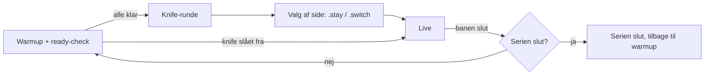

# Spiltyper

MatchZy kører serveren i én mode ad gangen. Admins skifter med en kommando i chatten; valget huskes på tværs af baneskift.

| Mode | Kommando | Knife | Runder | Penge | Brug den til |
|---|---|---|---|---|---|
| **Match** | `.match` | Ja | MR12 med overtid, kan afgøres tidligt | 800 | Konkurrencekampe og pugs. |
| **Scrim** | `.scrim` | Nej | Alle 24 runder spilles, ingen overtid | 800 | Scrims, hvor begge halvlege skal spilles færdige. |
| **Hill** | `.hill` | Nej | Alle 24 runder spilles | 16000 | Full-buy-runder, fx retakes eller aim-træning med hold. |
| **Practice** | `.prac` | - | Uendelige | Ubegrænsede, køb overalt | Lære lineups, spawns og udførelser. |
| **Dryrun** | `.dry` | Nej | Live-lignende runder, til den stoppes | 16000 | Øve udførelser mod bots eller dit hold. |
| **Sleep** | `.sleep` | - | - | - | Hvilende server uden noget loadet. |

Hver mode kører sin egen cfg fra `cfg/MatchZy/` (`live.cfg`, `scrim.cfg`, `hill.cfg`, `prac.cfg`, `dryrun.cfg`, `sleep.cfg`, plus `warmup.cfg` og `knife.cfg`). Ret i de filer, eller bedre i en `<mode>_override.cfg`, for at ændre reglerne. Se [Filer og mapper](../reference/files.md#server-specific-settings).

## Mode ved opstart { #mode-on-startup }

`matchzy_autostart_mode` bestemmer, hvad en ny bane starter i:

| Værdi | Resultat |
|---|---|
| `0` | Sleep, intet loadet. |
| `1` | Match-warmup (standard). |
| `2` | Practice. |

Mode-kommandoerne (`.prac`, `.match`, `.scrim`, `.sleep`, `.exitprac`) sætter også denne værdi, så en practice-server bliver i practice efter `.map`.

## Kampens forløb { #match-flow }

Med en match config kører vetoet før warmup. Scrim og hill springer knife-runden over.
