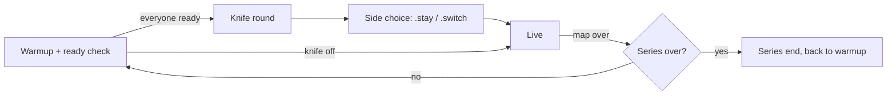

# Game modes

MatchZy runs the server in one mode at a time. Admins switch with a chat command; the choice is remembered across map changes.

| Mode | Command | Knife | Rounds | Money | Use it for |
|---|---|---|---|---|---|
| **Match** | `.match` | Yes | MR12 with overtime, can clinch | 800 | Competitive matches and pugs. |
| **Scrim** | `.scrim` | No | All 24 rounds played, no overtime | 800 | Scrims where both halves should be played out. |
| **Hill** | `.hill` | No | All 24 rounds played | 16000 | Full-buy rounds, e.g. retakes-style or aim sessions with teams. |
| **Practice** | `.prac` | - | Endless | Unlimited, buy anywhere | Learning lineups, spawns, executes. |
| **Dryrun** | `.dry` | No | Live-like rounds until stopped | 16000 | Running executes against bots or your team. |
| **Sleep** | `.sleep` | - | - | - | Idle server with nothing loaded. |

Every mode executes its own cfg from `cfg/MatchZy/` (`live.cfg`, `scrim.cfg`, `hill.cfg`, `prac.cfg`, `dryrun.cfg`, `sleep.cfg`, plus `warmup.cfg` and `knife.cfg`). Edit those files, or better a `<mode>_override.cfg`, to change the rules. See [Files and folders](../reference/files.md#server-specific-settings).

## Mode on startup

`matchzy_autostart_mode` decides what a fresh map starts in:

| Value | Result |
|---|---|
| `0` | Sleep, nothing loaded. |
| `1` | Match warmup (default). |
| `2` | Practice. |

The mode commands (`.prac`, `.match`, `.scrim`, `.sleep`, `.exitprac`) also set this value, so a practice server stays in practice after `.map`.

## Match flow

With a match config the veto runs before warmup. Scrim and hill skip the knife round.
